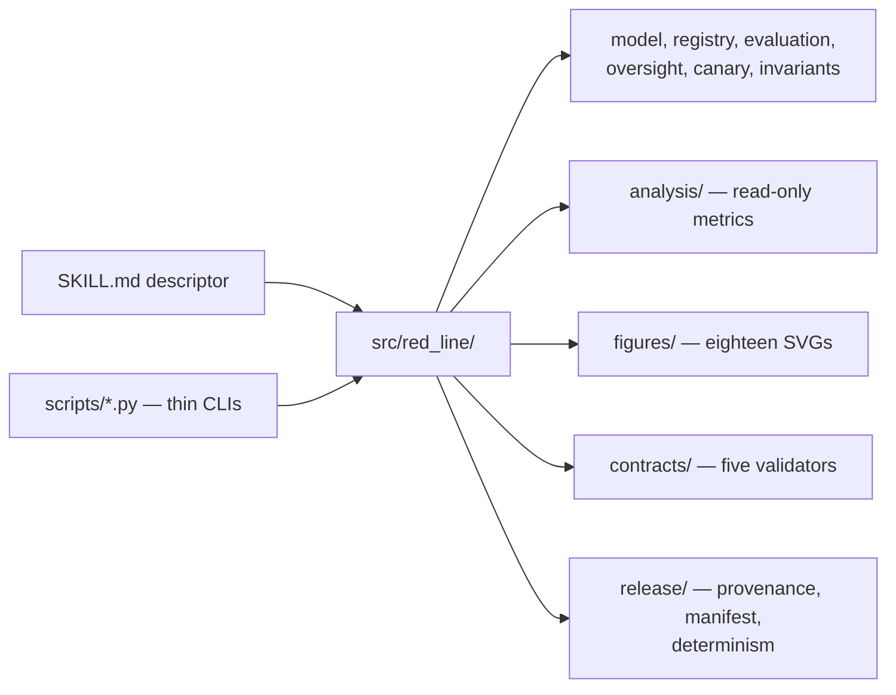

# personal-red-lines

Public skill descriptor for the Red Line framework. It tells an agent runtime
that this capability exists and where to route; the operational implementation
(`daf-red-line`) lives in the author's private skills repository
`docxology/daf-skills` and is not in this tree.

| File | Purpose |
| --- | --- |
| [SKILL.md](SKILL.md) | The descriptor: frontmatter, worked operations, public entry points, boundary. |
| [AGENTS.md](AGENTS.md) | Folder contract — what may and may not be written here, and how to keep the descriptor bound to the code. |
| [README.md](README.md) | This pointer. |

## What the capability does

Evaluate a proposed engagement against a versioned registry of personal red
lines, record a review finding, issue or verify a warrant canary over the
registry hash, derive read-only registry-composition and outcome-coverage
analytics, and propose versioned edits.

It is not a safety score, an accreditation, a moral authority, or a permission
mechanism. It makes one author's commitments inspectable and their weakening
detectable.

## Where the behavior lives

Every command in [SKILL.md](SKILL.md) runs from the project root and is
copy-pasteable. Start with the evaluate example, then the analytics block, then
`scripts/check_canary.py`.

## Cross-refs

- Project root: [../../..](../../../README.md)
- Skill folder contract: [AGENTS.md](AGENTS.md)
