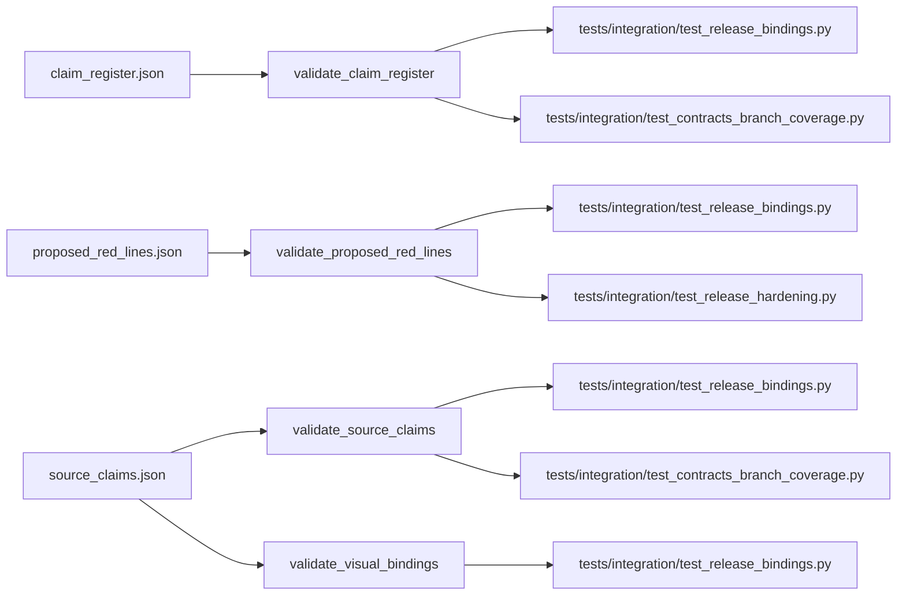

# data

This folder holds the machine-readable contracts that the release validators read. The files are edited by hand and are expected to stay in sync with the matching prose and tests.

## Inventory

| File | Top-level keys | What it binds |
| --- | --- | --- |
| [claim_register.json](claim_register.json) | `schema_version`, `claim_classes`, `verification_modes`, `claims` | The published claim table in `docs/claim-register.md`. |
| [proposed_red_lines.json](proposed_red_lines.json) | `schema_version`, `registry_effect`, `decision_policy`, `candidates` | The six candidate-line decision rows in `docs/PROPOSED_RED_LINES.md`. |
| [source_claims.json](source_claims.json) | `schema_version`, `source_document`, `interpretive_ledger`, `record_policy`, `records`, `figure_bindings` | `manuscript/references.bib`, manuscript citations, `docs/research-method.md`, and the source-driven figure bindings. |
| [formalism_claim_ledger.json](formalism_claim_ledger.json) | `1.0` | Every formalism-block label declared in `manuscript/08a_formalism.md` plus the package's evidence-freshness window, so the render engine's evidence registry resolves a `[@def:…]`/`[@prop:…]` cross-reference instead of reporting it as an unsupported bibliography citation. | none (read by the render engine's evidence registry) | [test_formalism_bindings.py](../tests/integration/test_formalism_bindings.py) |

## Binding path

## Editing rule

These files are contract surfaces. If you change one, update the validator under [contracts README](../src/red_line/contracts/README.md) and the prose surface it binds in the same change, then rerun the integration checks.

## Related

- [AGENTS.md](AGENTS.md)
- [contracts README](../src/red_line/contracts/README.md)
- [references.bib](../manuscript/references.bib)
- [research-method.md](../docs/research-method.md)
