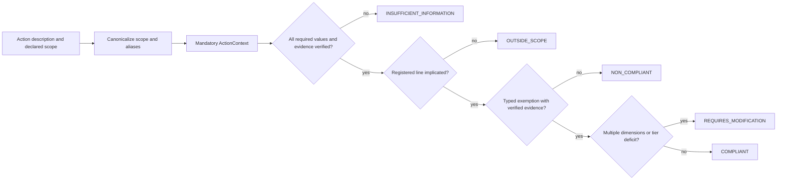

# Architecture

Red Line is a pure-standard-library, evidence-gated personal security boundary.
The package turns a first-person refusal into a versioned registry, a strict
intake record, a deterministic evaluator, a review finding, and a canary. It
does not enforce execution or claim universal moral authority.

## Modules

| Module | Responsibility |
|---|---|
| `analysis/` | read-only registry and evaluator derivations, deterministic reports, no policy mutation |
| `model/` | enums, evidence records, action context, red-line records, typed exemptions, normalization |
| `registry/` | seven first-person red lines and their structured exemption requirements |
| `evaluation/` | intake gate, scope matching, exemption verification, tier and classification logic |
| `oversight/` | frozen findings, non-bypassable authorizations, structured reason/evidence traces, transparency aggregation |
| `canary/` | canonical registry payloads, hashes, dated statements, freshness and drift checks |
| `figures/` | deterministic SVG figure generation, PNG rasterization, source-bound captions and registry metadata |
| `contracts/` | release-binding validators, source and figure drift checks, pure `list[str]` error reporting |
| `release/` | provenance digests and git state, the deterministic input snapshot, the release manifest, and render-determinism comparison |
| `invariants/` | pure structural checks over ids, scope, severity, types, and typed exemptions |
| `envelope.py` | the common report envelope: complete canonical `ReviewFinding` serialization (`red-line.report/1.0`), its SHA-256 digest, and the cross-line witness record (`line.report-envelope/1.0`) that points at — never reinterprets — the native finding |

## Evaluation flow

The figure generated from this flow is schematic. It describes code paths, not
observed safety outcomes.

## Entry points

`scripts/` is not part of the `red_line` package or the distributed wheel. The
files in that top-level directory are thin CLIs: they import `red_line` as an
ordinary top-level import — the package is installed, so no path setup is
involved — then delegate to package functions for real work. They own process
setup, argument parsing, stdout/stderr, and exit codes; they do not own domain
logic. A script needing the checkout root derives it from its own location
rather than from a package helper, which would resolve to `site-packages` under
a wheel install.

## Import direction

`model → registry → evaluation → oversight` is the primary policy path.
`analysis` depends on `evaluation`, `model`, and `registry`. `canary` and
`invariants` depend only on `model` and `registry`. `figures` sits above those
layers: its modules import from `analysis`, `model`, and `registry` plus local
SVG helpers. `contracts` sits at the top: its validators import the root
package, `canary`, and `figures` to bind release surfaces back to live source.
`release` sits beside `contracts` at that same top layer, importing the root
package, `analysis`, `canary`, and `contracts`. The top-level `envelope.py`
module also sits at the top layer: it imports `oversight`, `canary`,
`registry`, `model`, and `version`, and nothing below it imports it back.
Nothing in `analysis/`,
`canary/`, `evaluation/`, `invariants/`, `model/`, `oversight/`, or `registry/`
imports `figures/`, `contracts/`, `release/`, or `envelope.py`, so those
surfaces remain
terminal adapters rather than cycle-forming dependencies. The
root package re-exports the public API; no module imports the sibling template
engine.

`release/` is the one subpackage that performs I/O by design: `provenance`
hashes files and shells out to `git`, `snapshot` writes
`output/data/release_inputs.json`, `manifest` reads the validation reports back,
and `determinism` invokes the sibling template's render stages twice and
compares the results. That I/O is the point of the subpackage; the domain path
from `model` through `oversight` stays pure, and the sibling template is reached
only as a subprocess, never as an import.

## Registry integrity

Every line has narrative carve-outs plus typed `Exemption` records. The canary
payload includes both forms, exemption triggers, and required evidence kinds, so
changing executable semantics changes the digest. The two CANARY lines remain
present, retain CANARY severity, and cannot be assigned an AIR_GAPPED ceiling.

## Review integrity

Review findings preserve the result returned by the evaluator, including stable
reason codes, normalized scope, and evidence-stop dimensions. An authorization
is an audit record, not a permission override. This keeps the self-review layer
honest: it can expose an escalation, but it cannot certify a blocked action.
