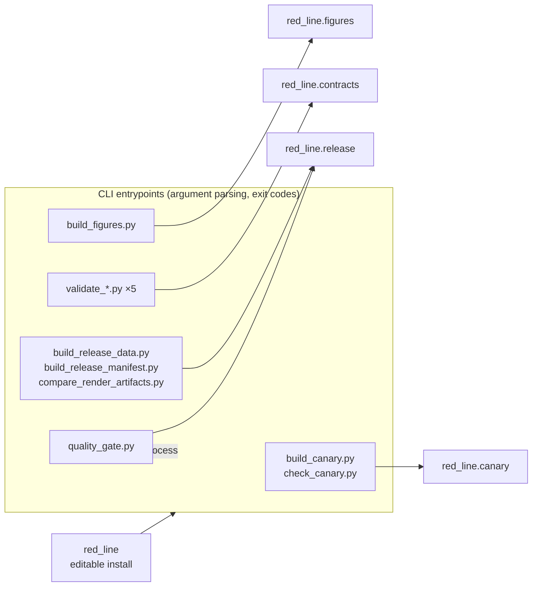

# Scripts

The `scripts/` tree is the repo-local operator surface. Every entrypoint
imports `red_line` directly — the package is installed, so there is no path
setup — then hands the work to a package function. None of it ships in the
wheel, and none of it owns domain logic — if you find yourself adding a rule
here, it belongs in `src/red_line/`.

## Layout

`quality_gate.py` is the one exception to the one-call rule: it sequences the
other scripts as subprocesses, which is its purpose rather than a domain
concern. Its two self-contained checks — the figure-tree digest and the wheel
smoke — live in `red_line.release` (`tree_digest`, `wheel_smoke`), not inline.

## What each script does

| Script | Purpose | Delegates to | Run command |
| --- | --- | --- | --- |
| [`build_canary.py`](build_canary.py) | Prints the dated canary statement and registry digest; `--json` matches the committed fixture serialization byte for byte. | `red_line.canary.issue_canary` | `uv run python scripts/build_canary.py [DATE] [--json]` |
| [`check_canary.py`](check_canary.py) | Recomputes the registry hash and per-line digests against the committed prior; exit 0 means intact. | `red_line.canary.verify_canary` | `uv run python scripts/check_canary.py [--prior PATH] [--as-of DATE]` |
| [`build_figures.py`](build_figures.py) | Writes eighteen deterministic SVGs, their PNG rasterizations, and `output/figures/figure_registry.json`. | `red_line.figures.build_figures` | `uv run python scripts/build_figures.py` |
| [`validate_source_claims.py`](validate_source_claims.py) | Checks the source/claim ledger against the manuscript citations. | `red_line.contracts.validate_source_claims` | `uv run python scripts/validate_source_claims.py` |
| [`validate_claim_register.py`](validate_claim_register.py) | Binds `data/claim_register.json` to its prose table in `docs/claim-register.md`. | `red_line.contracts.validate_claim_register` | `uv run python scripts/validate_claim_register.py` |
| [`validate_proposed_red_lines.py`](validate_proposed_red_lines.py) | Checks the candidate ledger and that every candidate remains non-adopted. | `red_line.contracts.validate_proposed_red_lines` | `uv run python scripts/validate_proposed_red_lines.py` |
| [`validate_release_bindings.py`](validate_release_bindings.py) | Checks code, beacon prose, metadata, and canary surfaces as one contract. | `red_line.contracts.validate_release_bindings` | `uv run python scripts/validate_release_bindings.py` |
| [`validate_visual_bindings.py`](validate_visual_bindings.py) | Checks figure source IDs, captions, alt text, and rendered files against the source ledger. | `red_line.contracts.validate_visual_bindings` | `uv run python scripts/validate_visual_bindings.py` |
| [`build_release_data.py`](build_release_data.py) | Writes `output/data/release_inputs.json`, the deterministic source-to-render boundary snapshot. | `red_line.release.write_snapshot` | `uv run python scripts/build_release_data.py` |
| [`build_release_manifest.py`](build_release_manifest.py) | Writes the hash-addressed release manifest; `--strict` additionally requires clean source and template checkouts. | `red_line.release.build_manifest`, `release_ready` | `uv run python scripts/build_release_manifest.py [--strict] [--as-of DATE]` |
| [`compare_render_artifacts.py`](compare_render_artifacts.py) | Runs two canonical render passes and reports byte, non-PDF, and PDF-text equality. | `red_line.release.compare_artifacts` | `uv run python scripts/compare_render_artifacts.py [--hash-only] [--output PATH]` |
| [`quality_gate.py`](quality_gate.py) | The full local gate: figures, validators, canary, figure determinism, wheel smoke; `--render` adds the render comparison and the strict manifest. | the scripts above, as subprocesses; `red_line.release.tree_digest`, `red_line.release.wheel_smoke` | `uv run python scripts/quality_gate.py [--as-of DATE] [--render]` |

`scripts/__init__.py` is a package marker, not an entrypoint: it keeps explicit
imports of these wrappers (`from scripts import build_canary`) resolving to this
checkout rather than a sibling's package.

Every script signals failure through a non-zero exit code and prints the reason;
the validators print the full `list[str]` of errors their contract module
returned rather than stopping at the first one.

## Related

- [../README.md](../README.md) — project overview
- [AGENTS.md](AGENTS.md) — thin-orchestrator contract, inventory, gotchas
- [../docs/architecture.md](../docs/architecture.md) — layer boundaries
- [../src/red_line/README.md](../src/red_line/README.md) — the package these scripts call
