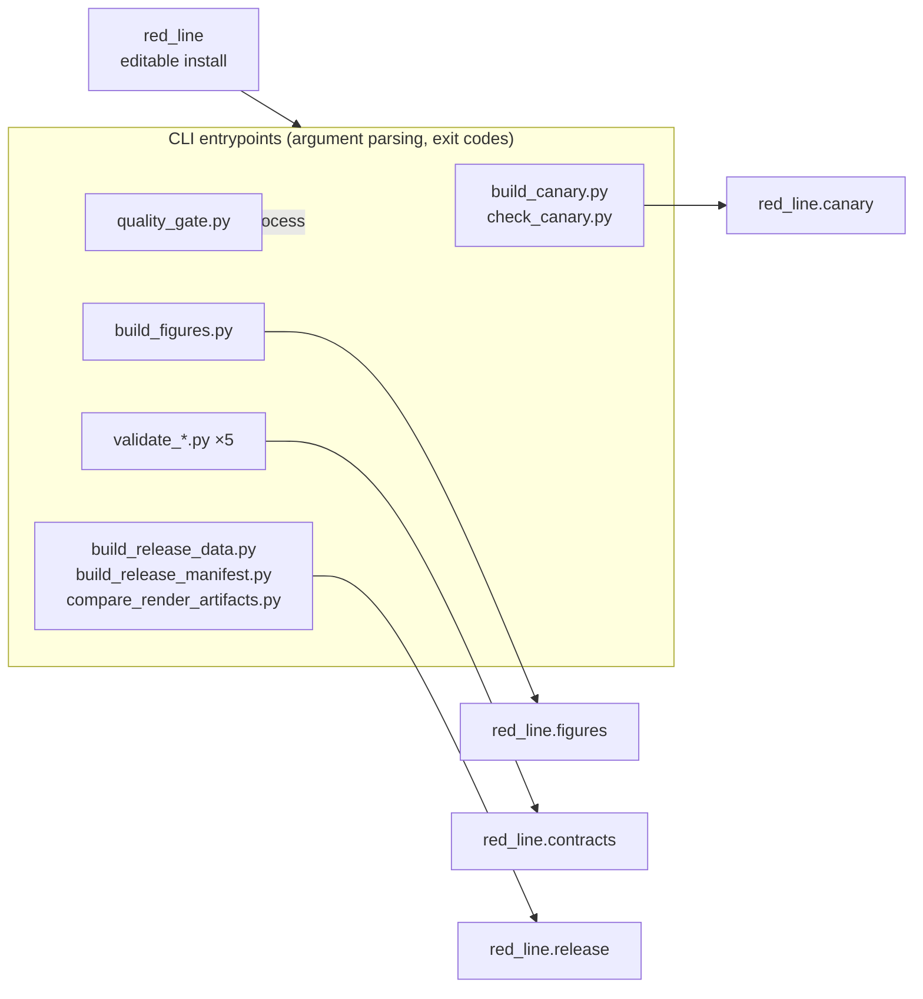

# Scripts

The `scripts/` tree is the repo-local operator surface. Every entrypoint imports
`red_line` directly — the package is installed, so there is no path setup — then
hands the work to a package function. None of it ships in the wheel, and none of
it owns domain logic — if you find yourself adding a rule here, it belongs in
`src/red_line/`.

## Layout



`quality_gate.py` is the one exception to the one-call rule: it sequences the
other scripts as subprocesses, which is its purpose rather than a domain
concern.

## What each script does

| Script | Delegates to | Result |
| --- | --- | --- |
| [`build_canary.py`](build_canary.py) | `red_line.canary.issue_canary` | Prints the dated statement and registry digest; `--json` matches the committed fixture serialization byte for byte. |
| [`check_canary.py`](check_canary.py) | `red_line.canary.verify_canary` | Recomputes the registry hash and per-line digests against the committed prior; exit 0 means intact. |
| [`build_figures.py`](build_figures.py) | `red_line.figures.build_figures` | Writes eighteen deterministic SVGs, their PNG rasterizations, and `output/figures/figure_registry.json`. |
| [`validate_source_claims.py`](validate_source_claims.py) | `red_line.contracts.source_claims` | Checks the source/claim ledger against the manuscript citations. |
| [`validate_claim_register.py`](validate_claim_register.py) | `red_line.contracts.claim_register` | Binds `data/claim_register.json` to its prose table in `docs/claim-register.md`. |
| [`validate_proposed_red_lines.py`](validate_proposed_red_lines.py) | `red_line.contracts.proposed_red_lines` | Checks the candidate ledger and that every candidate remains non-adopted. |
| [`validate_release_bindings.py`](validate_release_bindings.py) | `red_line.contracts.release_bindings` | Checks code, beacon prose, metadata, and canary surfaces as one contract. |
| [`validate_visual_bindings.py`](validate_visual_bindings.py) | `red_line.contracts.visual_bindings` | Checks figure source IDs, captions, alt text, and rendered files against the source ledger. |
| [`build_release_data.py`](build_release_data.py) | `red_line.release.write_snapshot` | Writes `output/data/release_inputs.json`, the deterministic source-to-render boundary snapshot. |
| [`build_release_manifest.py`](build_release_manifest.py) | `red_line.release.build_manifest`, `release_ready` | Writes the hash-addressed release manifest; `--strict` additionally requires clean source and template checkouts. |
| [`compare_render_artifacts.py`](compare_render_artifacts.py) | `red_line.release.compare_artifacts` | Runs two canonical render passes and reports byte, non-PDF, and PDF-text equality. |
| [`quality_gate.py`](quality_gate.py) | the scripts above, as subprocesses | The full local gate; `--render` adds the render comparison and the strict manifest. |

## Usage

```bash
# rebuild deterministic figures before any render
uv run python scripts/build_figures.py

# the five validators
uv run python scripts/validate_source_claims.py
uv run python scripts/validate_claim_register.py
uv run python scripts/validate_proposed_red_lines.py
uv run python scripts/validate_release_bindings.py
uv run python scripts/validate_visual_bindings.py

# canary
uv run python scripts/check_canary.py

# the whole gate, with the canary date pinned
uv run python scripts/quality_gate.py --as-of 2026-07-27
```

Every script signals failure through a non-zero exit code and prints the reason;
the validators print the full `list[str]` of errors their contract module
returned rather than stopping at the first one.

## Related

- [../README.md](../README.md) — project overview
- [AGENTS.md](AGENTS.md) — signatures, import direction, invariants
- [../docs/architecture.md](../docs/architecture.md) — layer boundaries
- [../src/red_line/README.md](../src/red_line/README.md) — the package these scripts call
