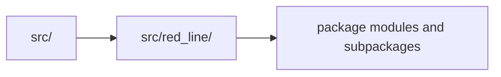

# src layout

This repo uses a standard `src/` layout. The installable package starts at `src/red_line/`.

## Layout

## Related

- [../README.md](../README.md)
- [../docs/architecture.md](../docs/architecture.md)
- [red_line/README.md](red_line/README.md)

See [AGENTS.md](AGENTS.md) for the working contract.
