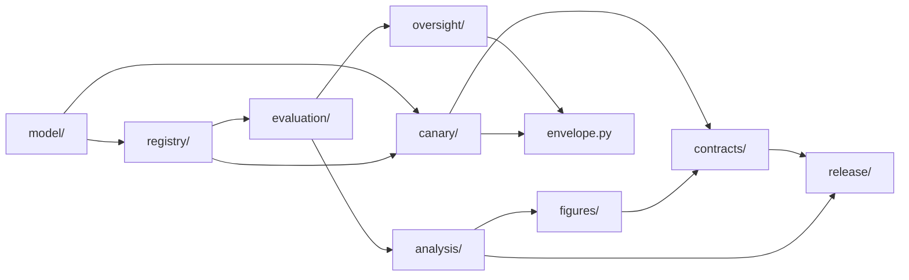

# red_line package

The package root binds the subpackages into one import surface. It exposes the model, evaluator, oversight, canary, invariant, and registry APIs without holding their business logic itself. One top-level module, `envelope.py`, owns the common report envelope (see [../../docs/correspondence.md](../../docs/correspondence.md)).

## Layout



## Usage

```python
from red_line import ProposedAction, evaluate_action, PERSONAL_RED_LINES
```

## Related

- [../../README.md](../../README.md)
- [../../docs/architecture.md](../../docs/architecture.md)
- [model/README.md](model/README.md)
- [evaluation/README.md](evaluation/README.md)
- [release/README.md](release/README.md)

See [AGENTS.md](AGENTS.md) for the working contract.
