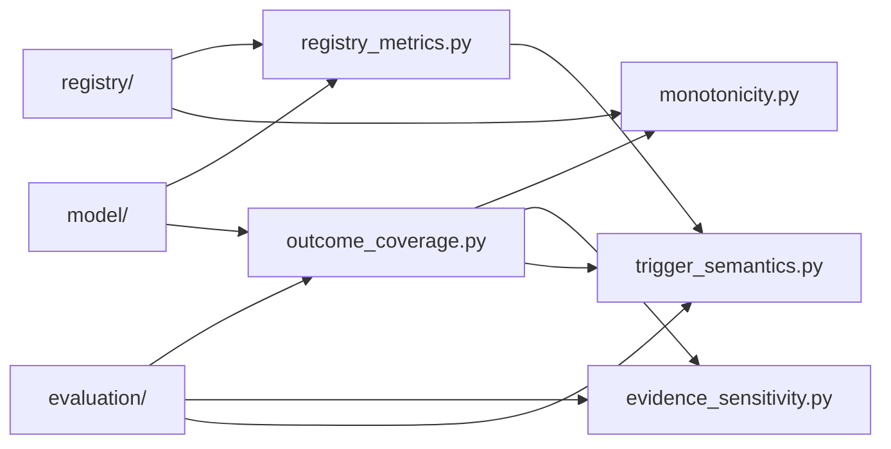

# analysis

The analysis package computes structural views over the registry and evaluator: composition summaries (including per-token line membership), a five-case outcome battery, a tier-monotonicity sweep, a single-dimension evidence perturbation sweep, and an ANY/ALL trigger-semantics probe.

## Layout



## Usage

```python
from red_line.analysis import run_outcome_coverage

report = run_outcome_coverage()
print(report.complete, report.reached)
```

## Related

- [../README.md](../README.md)
- [../../../docs/architecture.md](../../../docs/architecture.md)
- [../../../tests/analysis/test_outcome_coverage.py](../../../tests/analysis/test_outcome_coverage.py)

See [AGENTS.md](AGENTS.md) for the working contract.
