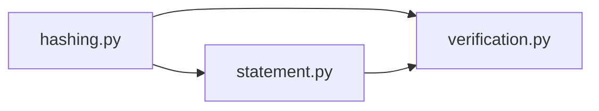

# canary

The canary package reduces the live registry to stable digests, binds them into dated statements, and verifies whether a prior statement is still fresh and intact.

## Layout



## Usage

```python
from red_line.canary import issue_canary, verify_canary

statement = issue_canary("2026-07-15")
result = verify_canary(statement, as_of="2026-07-15")
```

## Related

- [../README.md](../README.md)
- [../../../docs/canary-and-trust-model.md](../../../docs/canary-and-trust-model.md)
- [../../../tests/canary/test_verification.py](../../../tests/canary/test_verification.py)

See [AGENTS.md](AGENTS.md) for the working contract.
