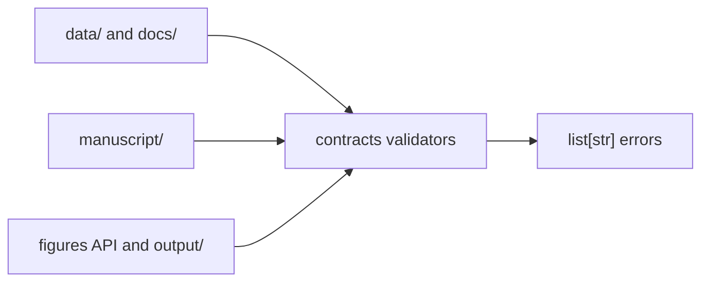

# contracts

The contracts package binds release-facing prose, metadata, figures, and ledgers back to the live source tree. It is the package-side validation surface used by CLIs and release assembly.

## Layout



## Usage

```python
from pathlib import Path
from red_line.contracts import validate_release_bindings

errors = validate_release_bindings(Path('.'))
```

## Related

- [../README.md](../README.md)
- [../../../docs/VERIFY.md](../../../docs/VERIFY.md)
- [../../../tests/integration/test_contracts_branch_coverage.py](../../../tests/integration/test_contracts_branch_coverage.py)

See [AGENTS.md](AGENTS.md) for the working contract.
