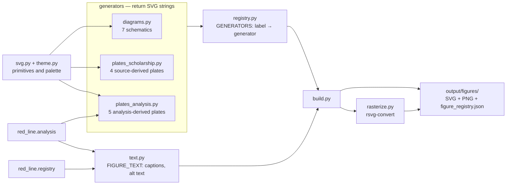

# figures

The figures package renders the manuscript's eighteen visuals from live package
state. Schematic diagrams, scholarship plates, analysis plates, and the figure
registry are generated here, then rasterized into `output/figures/`. Output is
byte-deterministic: two runs on an unchanged tree produce identical SVGs.

## Layout



`registry.py` is the only module that knows which file a generator lives in, so
moving a generator between plate modules never reaches a caller. Which module a
new figure belongs in — and why the split is by provenance rather than size — is
in [AGENTS.md](AGENTS.md).

## Usage

```python
from pathlib import Path
from red_line.figures import build_figures

paths = build_figures(Path('.'))
```

The CLI wrapper is `scripts/build_figures.py`, which does nothing but call
`build_figures()` and print the count.

## Related

- [AGENTS.md](AGENTS.md) — public surface, placement rule, invariants
- [../README.md](../README.md) — the package this belongs to
- [../../../docs/visualization-briefs.md](../../../docs/visualization-briefs.md) — per-figure briefs and acceptance gate
- [../../../tests/test_figures.py](../../../tests/test_figures.py) — determinism and binding tests
- [../../../tests/test_figure_legibility.py](../../../tests/test_figure_legibility.py) — rendered point-size gate over every registered figure
- [../../../tests/test_new_composition_figures.py](../../../tests/test_new_composition_figures.py) — derivation and planted-defect proofs for the two composition plates
