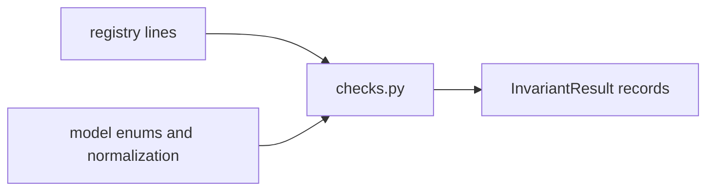

# invariants

The invariants package checks registry shape rather than action outcomes. It exists to make silent weakening of the beacon structurally detectable.

## Layout



## Usage

```python
from red_line.invariants import all_invariants, invariants_pass

print(invariants_pass())
results = all_invariants()
```

## Related

- [../README.md](../README.md)
- [../../../docs/invariants.md](../../../docs/invariants.md)
- [../../../tests/invariants/test_checks.py](../../../tests/invariants/test_checks.py)

See [AGENTS.md](AGENTS.md) for the working contract.
