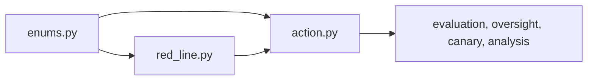

# model

The model package is the domain foundation of the project. It defines the vocabulary and record types that every higher layer uses.

## Layout



## Usage

```python
from red_line import ActionContext, EvidenceKind, EvidenceRecord, EvidenceStatus

record = EvidenceRecord(
    kind=EvidenceKind.PURPOSE,
    reference="fixture://purpose",
    summary="reviewed fixture",
    status=EvidenceStatus.VERIFIED,
    recorded_on="2026-07-15",
)
```

## Related

- [../README.md](../README.md)
- [../../../docs/evaluator-semantics.md](../../../docs/evaluator-semantics.md)
- [../../../tests/model/test_action.py](../../../tests/model/test_action.py)

See [AGENTS.md](AGENTS.md) for the working contract.
