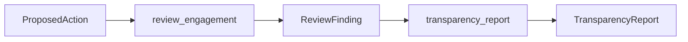

# oversight

The oversight package records the local review output after evaluation. It freezes the finding and optionally aggregates findings into a transparency report.

## Layout



## Usage

```python
from red_line.oversight import review_engagement

finding = review_engagement(action, reviewed_on="2026-07-15")
```

## Related

- [../README.md](../README.md)
- [../../../docs/decision-protocol.md](../../../docs/decision-protocol.md)
- [../../../tests/oversight/test_findings.py](../../../tests/oversight/test_findings.py)

See [AGENTS.md](AGENTS.md) for the working contract.
