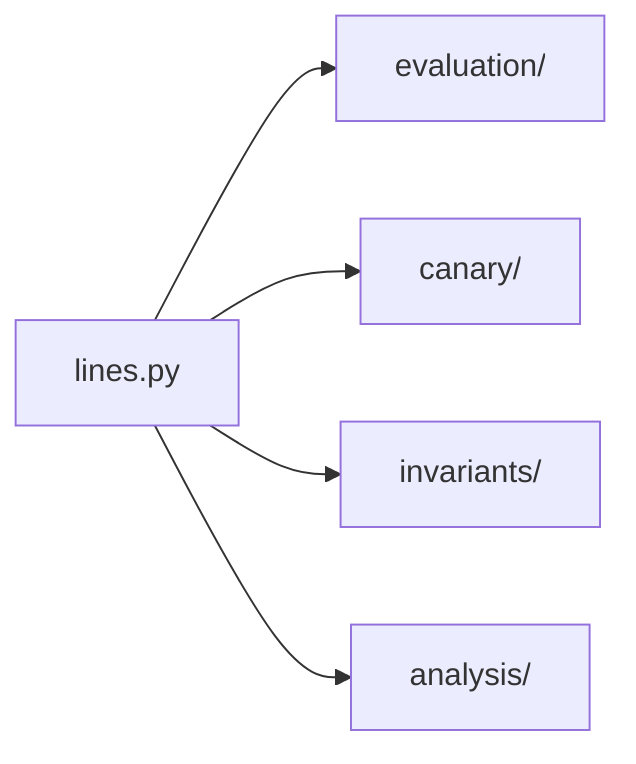

# registry

The registry package declares the live red lines and their provenance constants. Other packages read from it; none should duplicate its content.

## Layout



## Usage

```python
from red_line.registry import PERSONAL_RED_LINES

print(PERSONAL_RED_LINES[0].id)
```

## Related

- [../README.md](../README.md)
- [../../../docs/claim-register.md](../../../docs/claim-register.md)
- [../../../tests/registry/test_lines.py](../../../tests/registry/test_lines.py)

See [AGENTS.md](AGENTS.md) for the working contract.
