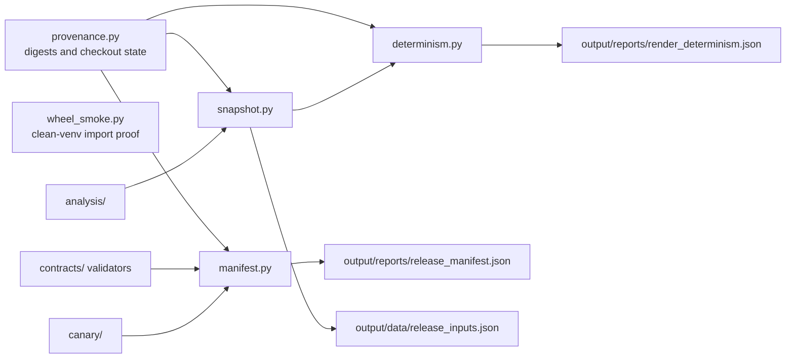

# release

The release package turns a source checkout and a rendered artifact tree into recorded evidence: content digests, a deterministic input snapshot, a hash-addressed manifest, a two-pass determinism report, and a wheel-build preflight. It holds the logic that the release CLIs used to carry themselves.

## Layout



## Usage

```python
from pathlib import Path
from red_line.release import build_manifest, compare_artifacts, release_ready

manifest = build_manifest(Path('.'), as_of='2026-07-27')
ready = release_ready(manifest, strict=True)

# Hash the current tree twice without invoking the sibling template renderer.
report = compare_artifacts(Path('.'))
```

Pass `render=template_render_passes(root)` to `compare_artifacts` to run the canonical
template render before each hashing pass.

## Related

- [../README.md](../README.md)
- [../../../scripts/README.md](../../../scripts/README.md)
- [../../../docs/VERIFY.md](../../../docs/VERIFY.md)
- [../../../tests/release/README.md](../../../tests/release/README.md)

See [AGENTS.md](AGENTS.md) for the working contract.
