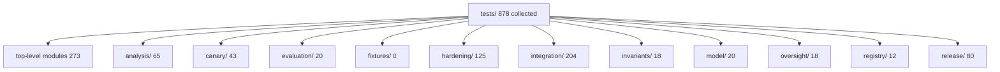

# tests

This folder holds the cross-cutting test suite for the project. The top level covers figures and shared hardening contracts; the subfolders carry the package-area and adversarial partitions.

## Suite layout



## Top-level module inventory

| Module | What it exercises | Collected tests |
| --- | --- | --- |
| [test_figures.py](test_figures.py) | Figure determinism and registry metadata | 16 |
| [test_figure_legibility.py](test_figure_legibility.py) | Printed text size and page-fit constraints | 30 |
| [test_decision_surface_figures.py](test_decision_surface_figures.py) | Decision-surface figure contracts | 14 |
| [test_new_composition_figures.py](test_new_composition_figures.py) | New-composition figure contracts | 20 |
| [test_script_clis.py](test_script_clis.py) | Every read-only script passes on good input | 49 |
| [test_standalone_contract.py](test_standalone_contract.py) | Package works without sibling repos | 9 |
| [test_publication_metadata.py](test_publication_metadata.py) | Publication metadata across config and package | 6 |
| [test_no_substitutes.py](test_no_substitutes.py) | No substitute/mock enforcement | 16 |
| [test_hardening_contracts.py](test_hardening_contracts.py) | Hardening contract enforcement | 43 |
| [test_suite_inventory_binding.py](test_suite_inventory_binding.py) | Suite inventory against source | 53 |
| [test_witness_envelope.py](test_witness_envelope.py) | Witness envelope export contract | 17 |

| Area | Path | Collected tests | Notes |
| --- | --- | --- | --- |
| cross-cutting | [tests](README.md) | 273 | Top-level figure, legibility, decision-surface plate, contract-hardening, script-CLI, no-substitute policy, standalone-copy contract, report-envelope, and publication-metadata tests. |
| analysis | [tests/analysis](analysis/README.md) | 65 | Executed reports over the live registry and evaluator. |
| canary | [tests/canary](canary/README.md) | 43 | Hashing, issuance, verification, and script entrypoints. |
| evaluation | [tests/evaluation](evaluation/README.md) | 20 | Classification, carve-outs, aliases, and tier monotonicity. |
| fixtures | [tests/fixtures](fixtures/README.md) | 0 | Committed JSON fixtures consumed by other tests. |
| hardening | [tests/hardening](hardening/README.md) | 125 | Adversarial constructor, scope, canary, and invariant checks. |
| integration | [tests/integration](integration/README.md) | 204 | Cross-surface bindings over manuscript, docs, data, and release surfaces. |
| invariants | [tests/invariants](invariants/README.md) | 18 | Structural invariant battery and proof-of-detection. |
| model | [tests/model](model/README.md) | 20 | Core dataclasses, enums, and normalization helpers. |
| oversight | [tests/oversight](oversight/README.md) | 18 | Review findings and transparency aggregation. |
| registry | [tests/registry](registry/README.md) | 12 | Registry shape and provenance anchors. |
| release | [tests/release](release/README.md) | 80 | Provenance digests, input snapshot, manifest, and render determinism. |

## Run

Use the project venv directly here. In the current managed environment, `uv run` tries to initialize the user-level uv cache, so the direct `.venv` entrypoint is the working form.

```bash
.venv/bin/python -m pytest tests -q
```

## Coverage gate

The project gate lives in [pyproject.toml](../pyproject.toml) as `--cov-fail-under=90` over `source = ["red_line"]`. The current full-suite measurement is `100.00%` with `878` passed tests on `2026-07-29`.

## Related

- [AGENTS.md](AGENTS.md)
- [package README](../src/red_line/README.md)
- [development.md](../docs/development.md)
